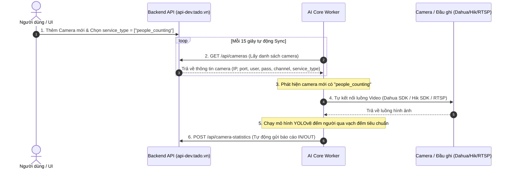

# 📋 BÁO CÁO TỔNG QUAN KIẾN TRÚC DỰ ÁN AI CORE (PEOPLE COUNTING WORKER)

---

## 🎯 1. Vai Trò Của Dự Án AI Core Trong Tổng Thể Hệ Thống

Dự án này là một **AI Background Worker đếm người thời gian thực** (Realtime People Counting Engine).

### ❌ Những gì dự án KHÔNG LÀM:
- **KHÔNG mở API cho UI (Frontend) gọi vào**: Bên UI không cần kết nối, không cần biết và không cần gọi bất kỳ lệnh nào vào AI Core. UI làm việc 100% trực tiếp với Backend API chính (`https://api-dev.tado.vn`).
- **KHÔNG bắt người dùng phải cấu hình thủ công**: Không cần bấm nút bật/tắt camera trên AI Core.

### ✅ Những gì dự án TỰ ĐỘNG THỰC HIỆN:
- 🔄 **Tự động quét camera từ Backend**: Lắng nghe và lấy danh sách camera qua API `GET https://api-dev.tado.vn/api/cameras`.
- 🤖 **Tự kích hoạt AI đếm người**: Khi tìm thấy bất kỳ camera nào được cài đặt tính năng `service_type` chứa `"people_counting"`, AI Core sẽ tự đọc thông số kết nối và mở luồng đếm người.
- 📤 **Tự báo cáo số liệu về Backend**: Khi có người vượt qua vạch đếm, AI Core tự động bắn dữ liệu đếm người (IN / OUT / COUNT) về `POST https://api-dev.tado.vn/api/camera-statistics`.

---

## 🔄 2. Luồng Hoạt Động Tự Động 100% (End-to-End Workflow)



---

## 📦 3. Cấu Trúc Payload AI Core Tự Báo Cáo Về Backend API

Mỗi khi phát sinh sự kiện đếm người, AI Core tự động gọi `POST /api/camera-statistics` với dữ liệu chuẩn:

```json
{
  "stream_id": "3fa85f64-5717-4562-b3fc-2c963f66afa6",
  "metric_type": "people_counting",
  "data": {
    "count": 2,
    "person": 2,
    "in": 15,
    "out": 10
  },
  "year": 2026,
  "month": 8,
  "day": 11,
  "hour": 15,
  "minute": 30
}
```

---

## 🚀 4. Các Tính Năng Kỹ Thuật Nổi Bật Của Dự Án

| Tính năng | Mô tả |
| :--- | :--- |
| **Đa chuẩn Camera Drivers** | Hỗ trợ mở luồng trực tiếp từ Dahua NetSDK, Hikvision HCNetSDK và luồng RTSP chuẩn mở. |
| **Zero Frame Accumulation Lag** | Thuật toán Producer-Consumer Threading tự động bỏ qua khung hình cũ khi bị dồn hàng đợi, giữ cho video luôn thời gian thực. |
| **Tùy chọn gRPC Microservice** | Có sẵn module gRPC Client để đẩy việc suy luận mô hình AI sang Server GPU từ xa khi cần mở rộng quy mô lớn. |
| **Báo cáo Bất Đồng Bộ** | Luồng gửi API đếm người về Backend chạy trên ThreadPool riêng biệt, không bao giờ gây chậm hay trễ luồng xử lý video AI. |

---

## 🐳 5. Đóng Gói & Triển Khai Docker

Để triển khai dự án lên máy chủ Local hoặc Server production:

```bash
# Đóng gói và chạy ngầm container
sudo docker compose up -d --build
```

- **Kiểm tra trạng thái Worker**: `curl http://localhost:8000/` Trả về số lượng camera đang được AI đếm ngầm.
- **Xem nhật ký hoạt động (Logs)**: `sudo docker logs -f ai_core_gateway`
